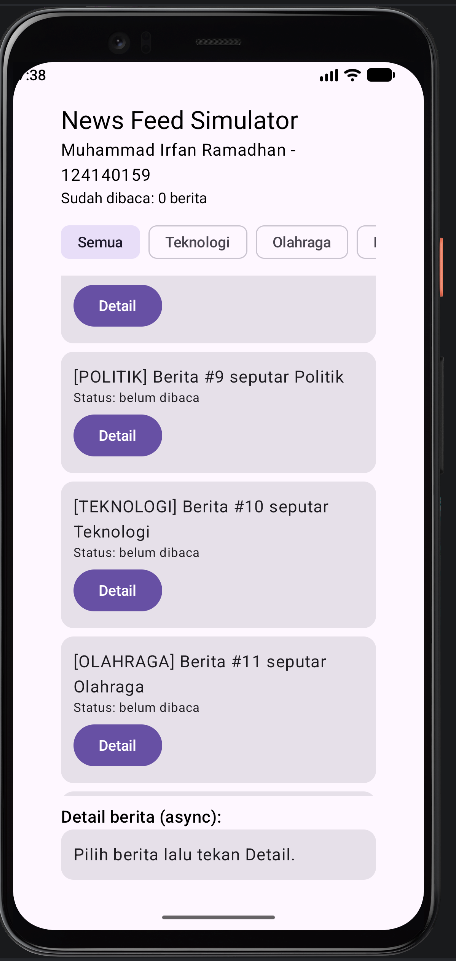

# Tugas 2 PAM - News Feed Simulator (Kotlin Multiplatform)

**Nama:** Muhammad Irfan Ramadhan  
**NIM:** 124140159
**Kelas PAM :** RA

Aplikasi News Feed Simulator, clone dari Tugas 1, sesuai tugas Pertemuan 2:

1. Flow mensimulasikan data berita baru setiap 2 detik (`NewsRepository.newsFeed()`)
2. Filter berita berdasarkan kategori (`Semua/Teknologi/Olahraga/Politik`)
3. Transform data menjadi format tampil `[KATEGORI] Judul` (`NewsDisplay`)
4. StateFlow menyimpan jumlah berita yang sudah dibaca (`readCount`)
5. Coroutines untuk mengambil detail berita secara async (`fetchDetail` + `loadDetail`)

## Screenshot Aplikasi

